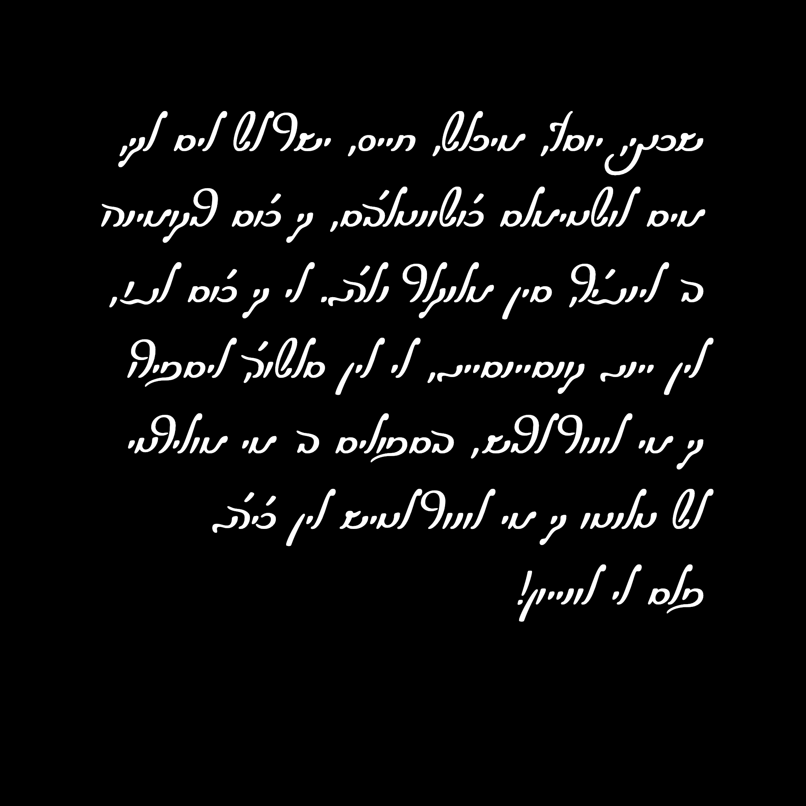

# Solitreo

[![][Fontbakery]](https://eliheuer.github.io/solitreo/fontbakery-report.html)
[![][Universal]](https://eliheuer.github.io/solitreo/fontbakery-report.html)
[![][GF Profile]](https://eliheuer.github.io/solitreo/fontbakery-report.html)
[![][Outline Correctness]](https://eliheuer.github.io/solitreo/fontbakery-report.html)
[![][Shaping]](https://eliheuer.github.io/solitreo/fontbakery-report.html)

[Fontbakery]: https://img.shields.io/endpoint?url=https%3A%2F%2Fraw.githubusercontent.com%2Feliheuer%2Fsolitreo%2Fgh-pages%2Fbadges%2Foverall.json
[GF Profile]: https://img.shields.io/endpoint?url=https%3A%2F%2Fraw.githubusercontent.com%2Feliheuer%2Fsolitreo%2Fgh-pages%2Fbadges%2FGoogleFonts.json
[Outline Correctness]: https://img.shields.io/endpoint?url=https%3A%2F%2Fraw.githubusercontent.com%2Feliheuer%2Fsolitreo%2Fgh-pages%2Fbadges%2FOutlineCorrectnessChecks.json
[Shaping]: https://img.shields.io/endpoint?url=https%3A%2F%2Fraw.githubusercontent.com%2Feliheuer%2Fsolitreo%2Fgh-pages%2Fbadges%2FShapingChecks.json
[Universal]: https://img.shields.io/endpoint?url=https%3A%2F%2Fraw.githubusercontent.com%2Feliheuer%2Fsolitreo%2Fgh-pages%2Fbadges%2FUniversal.json

Judeo-Spanish (Ladino) refers to the variety of Spanish that developed among Jewish populations who were expelled from Spain in 1492 and subsequently settled throughout Turkey and the Balkans, then of the Ottoman Empire. These Jews, known as Sephardim, preserved many features of Medieval (varieties of) Spanish, while incorporating linguistic elements from the languages spoken in their surroundings, including: Turkish, Greek, Serbo-Croatian, French, Italian, and Arabic. As a Jewish language, the Spanish of the Sephardim has always been in contact with Hebrew. And while Judeo-Spanish may sound like other Romance languages, in writing, it would have traditionally appeared more similar to a Semitic language.

Solitreo refers to the Hebrew-based cursive script once used by Sephardim; it is the cursive variety of the Rashi alphabet. Solitreo, or Soletreo, is derived from Galician/Portuguese, meaning ‘to spell.’ For many Sephardim, Solitreo was simply known as ganchos, meaning ‘hooks,’ due to the ligatures that form between letters. This style of writing is distinct from the Ashkenazi-based alphabet used for cursive Hebrew today, making documents in Solitreo undecipherable to the untrained eye. A similar style of writing can also be found in documents written in Judeo-Arabic. Today, Solitreo is a relic of the past, as most writers of the language utilize Roman characters.

## About

This font was developed by the [Documenting Judeo-Spanish Project](https://documentingjudeospanish.com/).

Documenting Judeo-Spanish is a digital humanities project that began in 2019 under the leadership of Dr. Bryan Kirschen. Recalling his initial fascination with Solitreo and the limited resources available to learn this script, Dr. Kirschen decided to focus this project on the cursive variety that was once common to speakers of Judeo-Spanish around the world. A nearly-extinct alphabet to an endangered language, this style of writing can be found in documents ranging from journal entries and ledgers to personal correspondence and community minutes. Many of these very documents are sitting in basements and attics today and, to the untrained eye, are mistaken for Hebrew.

## Building

Fonts are built automatically by GitHub Actions - take a look in the "[Actions](https://github.com/ladinoprojects/solitreo/actions)" tab for the latest build.

If you want to build fonts manually on your own computer:

* `make build` will produce font files.
* `make test` will run [FontBakery](https://github.com/googlefonts/fontbakery)'s quality assurance tests.
* `make proof` will generate HTML proof files.

Proof files, QA tests, and fonts are also available automatically for each commit to the main branch of this Git repository via GitHub Actions - look at https://github.com/ladinoprojects/solitreo/actions

## Font Files

To download font files, check the [Releases](https://github.com/ladinoprojects/solitreo/releases) section for major versions.

Each commit to this Git repository also has font files avaiable for download from the [Actions](https://github.com/ladinoprojects/solitreo/actions) tab.

## Changelog

**20 Sep 2022. Version 0.100**
- Add sample image to main README

**19 Sep 2022. Version 0.100**
- Final QA before onboarding

**16 Feb 2022. Version 0.100**
- Converted source file from SFD to UFO
- Added and updated files for the [GF-UFR](https://github.com/googlefonts/Unified-Font-Repository)

## License

This Font Software is licensed under the SIL Open Font License, Version 1.1.
This license is available with a FAQ at: [https://scripts.sil.org/OFL](https://scripts.sil.org/OFL)

## Repository Layout

This font repository structure is inspired by [Unified Font Repository v0.3](https://github.com/unified-font-repository/Unified-Font-Repository), modified for the [Google Fonts workflow](https://github.com/googlefonts/googlefonts-project-template).
